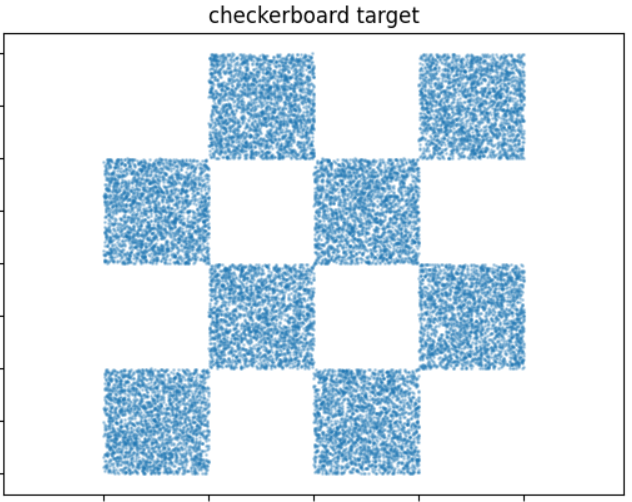

# Flow Maps via Self-Distillation  
### Reproduction (Toy Setting) — Consistency / Flow Map Models

This project implements a simplified version of the flow map training framework introduced in:

> **Boffi et al., 2025**  
> *How to Build a Consistency Model: Learning Flow Maps via Self-Distillation*

The objective is to reproduce the core ideas of:
- Flow map parameterization  
- Tangent condition (diagonal flow matching)  
- Self-distillation (LSD / PSD)  

in a controlled 2D toy setting (checkerboard dataset).

---

#  Objective

Traditional flow/diffusion models require solving an ODE at inference time.

Flow maps instead learn the **solution operator**:

\[
X_{s,t}(x) = x + (t - s) v_{s,t}(x)
\]

allowing:
- One-step generation
- Multi-step refinement via composition
- Faster inference

This project implements:

-  Diagonal Flow Matching loss  
-  Lagrangian Self-Distillation (LSD)  
-  Progressive Self-Distillation (PSD midpoint version)  
-  Multi-step sampling  


---


---

# Dataset: Toy Checkerboard

The target distribution is a multimodal 2D checkerboard with sharp boundaries.

Why this dataset?
- Tests multimodality
- Tests sharp geometry
- Allows exact visual inspection
- Allows histogram KL computation

Example (ground truth vs generated):

<p align="center">

</p>

---

# Training Objective

We optimize:

\[
L = L_b + L_D
\]

Where:

###  Diagonal Flow Matching
Enforces tangent condition:

\[
v_{t,t}(I_t) \approx \dot I_t
\]

###  Off-Diagonal Self-Distillation

#### LSD (Lagrangian)
\[
\| \partial_t \hat X_{s,t}(I_s) - v_{t,t}(\hat X_{s,t}(I_s)) \|^2
\]

#### PSD (Midpoint Semigroup)
\[
\| X_{s,t}(I_s) - X_{u,t}(X_{s,u}(I_s)) \|^2
\]

---

#  How to Run


```bash
pip install -r requirements.txt
python src/training.py --config configs/default.yaml
