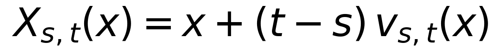
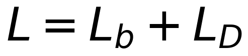
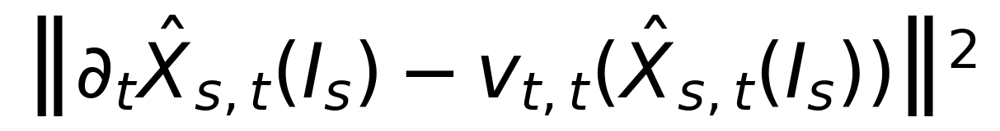
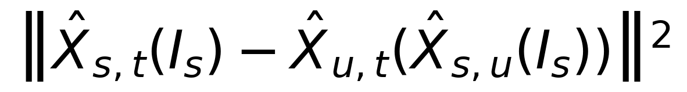
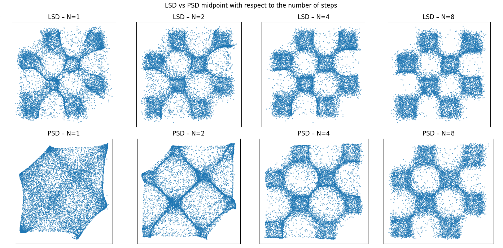

# Flow Maps via Self-Distillation  
### Reproduction (Toy Setting) — Consistency / Flow Map Models

This project implements a simplified version of the flow map training framework introduced in:

> **Boffi et al., 2025**  
> *How to Build a Consistency Model: Learning Flow Maps via Self-Distillation*

The objective is to reproduce the core ideas of:
- Flow map parameterization  
- Tangent condition (diagonal flow matching)  
- Self-distillation (LSD / PSD)  

in a controlled 2D toy setting (checkerboard dataset).

---

#  Objective

Traditional flow/diffusion models require solving an ODE at inference time.

Flow maps instead learn the **solution operator**:



allowing:
- One-step generation
- Multi-step refinement via composition
- Faster inference

This project implements:

-  Diagonal Flow Matching loss  
-  Lagrangian Self-Distillation (LSD)  
-  Progressive Self-Distillation (PSD midpoint version)  
-  Multi-step sampling  

---

# Dataset: Toy Checkerboard

The target distribution is a multimodal 2D checkerboard with sharp boundaries.

Why this dataset?
- Tests multimodality
- Tests sharp geometry
- Allows exact visual inspection
- Allows histogram KL computation

Example of 2D checkerboard :

<p align="center">

</p>

---

# Training Objective

We optimize:


Where:

###  Diagonal Flow Matching
Enforces tangent condition:


###  Off-Diagonal Self-Distillation

#### LSD (Lagrangian)

#### PSD (Midpoint Semigroup)


---

#  Results 


We compare Lagrangian Self-Distillation (LSD) and Progressive Self-Distillation (PSD, midpoint)
on the 2D checkerboard dataset using histogram-based KL divergence.

### KL Divergence

| Steps (N) | KL (LSD) | KL (PSD) |
|------------|----------|----------|
| 1          | 0.4576   | 1.5893   |
| 2          | 0.4298   | 0.8930   |
| 4          | 0.3515   | 0.5197   |
| 8          | 0.2651   | 0.3219   |
| 16         | 0.2508   | 0.2671   |

LSD consistently outperforms PSD across all step counts, with a particularly large gap in the single-step regime.
As the number of steps increases, both methods improve due to flow composition, but LSD remains more stable and converges faster.

### Qualitative Comparison

<p align="center">
  
</p>

Top row: LSD  
Bottom row: PSD (midpoint)

LSD preserves sharper multimodal structure at low step counts, whereas PSD exhibits geometric distortions for small N.  
Multi-step refinement mitigates these effects, but LSD demonstrates superior stability overall.

#  How to Run


```bash
pip install -r requirements.txt
python src/training.py --config configs/default.yaml
